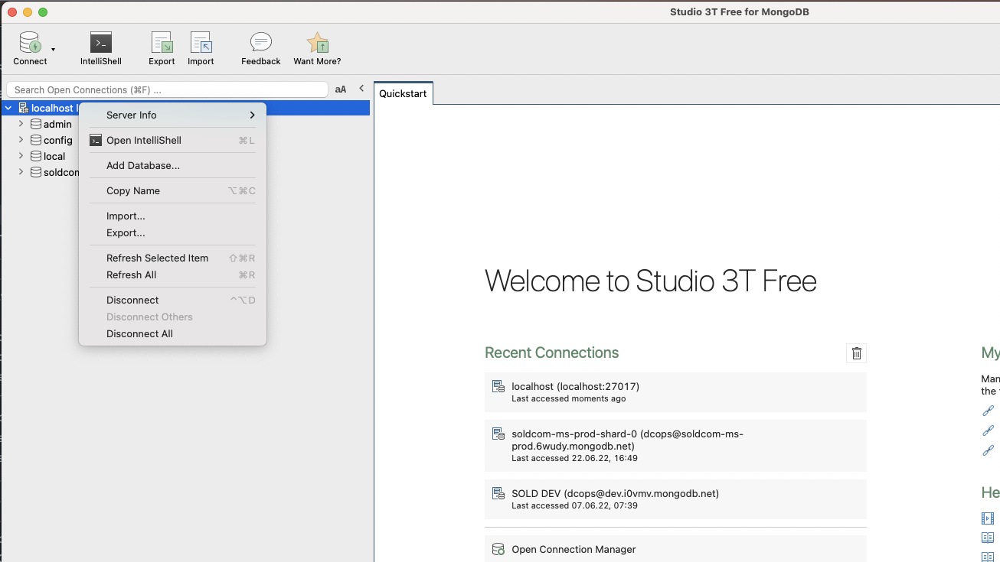
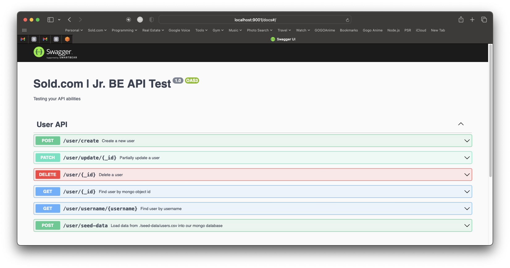

# Introduction

This project is set up with [NestJS](https://nestjs.com), which will be the primary back-end framework you will be working with.

Your abilities will be tested in the following:

- Typescript
- NodeJS
- MongoDB
- REST API
- Detail Orientation

When you are done with your project, please push to your personal github account, and share the link with the person who is administering this test.

## Description

Your tasks will consist of the following:

- [Introduction](#introduction)
  - [Description](#description)
    - [Set Up](#set-up)
      - [Install NodeJS](#install-nodejs)
      - [Clone project](#clone-project)
    - [Install Mongo](#install-mongo)
    - [Start App](#start-app)
    - [Create "users" collection](#create-users-collection)
    - [Modify/Update "Users API"](#modifyupdate-users-api)
    - [Seed Test Users](#seed-test-users)
    - [Validation](#validation)
    - [Questions](#questions)
  - [Resources](#resources)

### Set Up

#### Install NodeJS

Before getting started, you will need to be running NodeJS version 12 or 14.

I recommend installing [Node Version Manager](https://github.com/nvm-sh/nvm#installing-and-updating) or NVM for short.

Please google steps for installing for your environment (ie. mac, windows, linux, etc.).

Once installed, please install node v12 and set as your default.

```
nvm install 12.22.12
```

Then set as your default node version

```
nvm alias default 12.22.12
```

Confirm you are running version 12

```
node -v
```

#### Clone project

If you haven't already, clone the repo:

```
git clone https://github.com/brothatru/jr-nestjs-user-api-test.git
```

Install dependencies

```
cd <project_folder>
npm install
```

### Install Mongo

Download and install the community edition of MongoDB from https://www.mongodb.com/docs/manual/installation/.

After installing, you'll want to start the service.

Next, download and install [Studio 3T](https://robomongo.org). This is a GUI for connecting to your Mongo database, and will allow you to query your database for easier debugging and troubleshooting.

Open up Studio 3T and connect to localhost:27017.

Once connected, go ahead and create a new database named "soldcom".



### Start App

Once you've got Node and MongoDB installed, you can go ahead and start the app.

```
nest start --watch
```

This will start the project in **watch** mode at http://localhost:9001/docs#/, so any file changes will immediately take effect in the browser.



### Create "users" collection

The users collection should automatically already be created on app start.

You may need to refresh Studio 3T.

If not, go ahead and create manually using Studio 3T.

### Modify/Update "Users API"

I've set up a [User Controller](./src/modules/user/user.controller.ts) and set up the following endpoints already:

1. POST /user/create
   1. Save a new user into the database
2. DELETE /user/{\_id}
   1. Delete a user by mongo object id
3. GET /user/{\_id}
   1. Find a user by mongo object id

The following methods are stubbed, and you will need to fill in the logic by making changes to both the **User Controller** and the [User Service](./src/modules/user/user.service.ts):

1. PATCH /user/update/{\_id}
   1. This endpoint should allow you to partially update an EXISTING user by firstname, lastname, password, username, AND any combination of these.
2. GET /user/username/{username}
   1. Find a user by username
3. POST /user/search
   1. Search a user by any combination of these fields:
      1. firstname
      2. lastname
      3. username
   2. If NOT found, a 404 HTTP Exception should be thrown

For more info on controllers and services, you can find more in the NestJs Docs:

- https://docs.nestjs.com/controllers
- https://docs.nestjs.com/providers

### Seed Test Users

Seed test data from [users.csv](./seed-data/users.csv) using for loop.

The seed method in your **User Controller** has already been stubbed.

This method should save all users from the CSV file into our local mongo database.

Feel free to use existing service methods OR create your own.

### Validation

Typically, REST APIs have validation so that non-valid input is blocked.

ie. Invalid email should NOT be saved when creating a user

In NestJs, this is typically set up using **class validators** in DTO objects (Data Transfer Objects). I've set up a basic example to prevent empty data and non-strings from being entered. See [create-user.dto.ts](./src/modules/user/dto/create-user.dto.ts).


Your task is to add a new user field named "email".

This field will need to enforce valid emails when creating new users and updating existing users.

Don't worry about filling in previous existing user emails.

More info on validation can be found here: https://docs.nestjs.com/techniques/validation

### Questions

If you have any questions about anything, please reach out to the person or team that administered this test to you.

Other than that, happy coding!

## Resources

1. https://docs.nestjs.com
# nestJS-Jr-test

